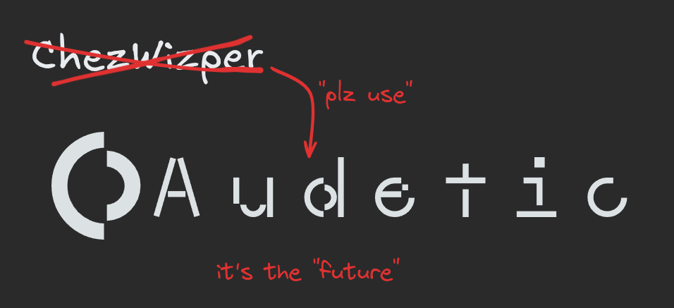

**ChezWizper is being deprecated in favor of [Audetic](https://github.com/silvabyte/Audetic)**

Migrate to Audetic:

- run `make uninstall` (from the repo dir) to remove ChezWizper
- then install audetic `curl -fsSL https://install.audetic.ai/cli/latest.sh | bash`
- its the same pig, but with new lipstick. Enjoy!

